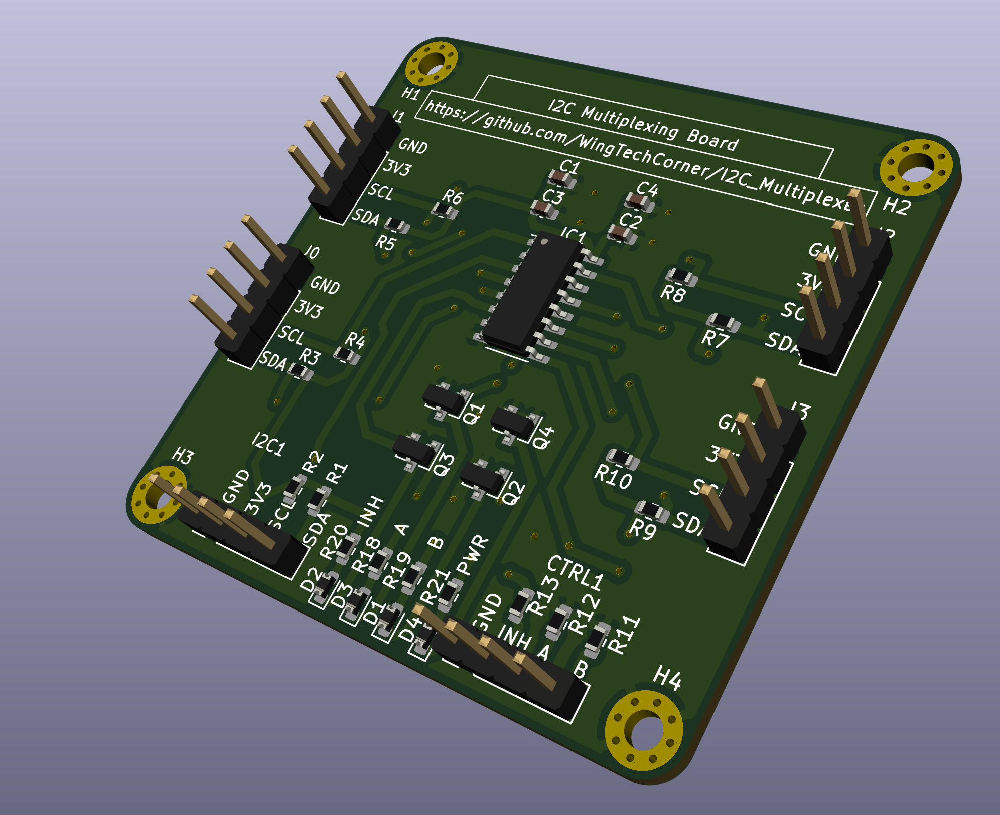
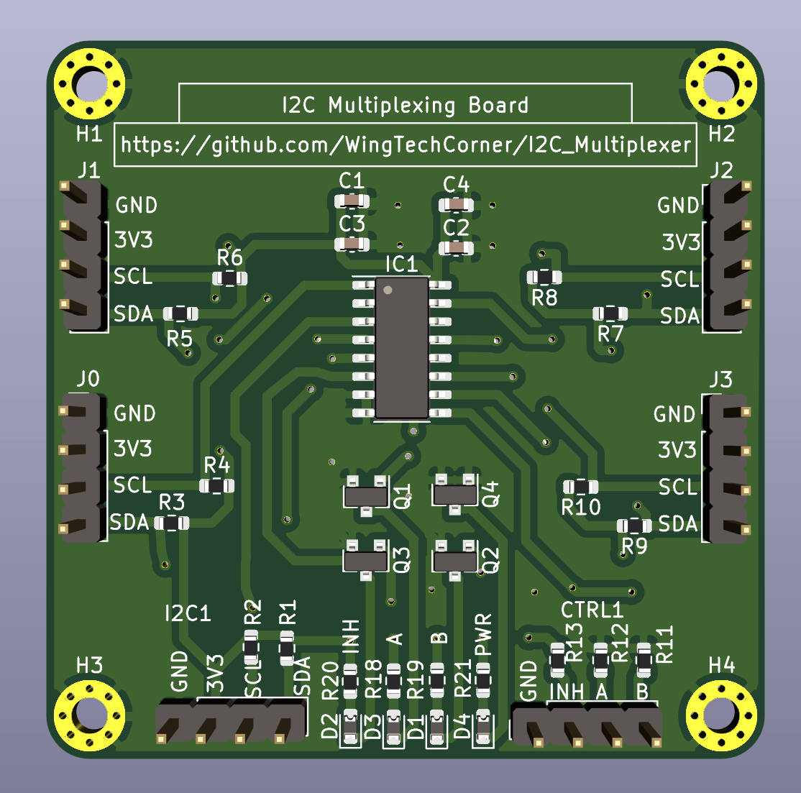
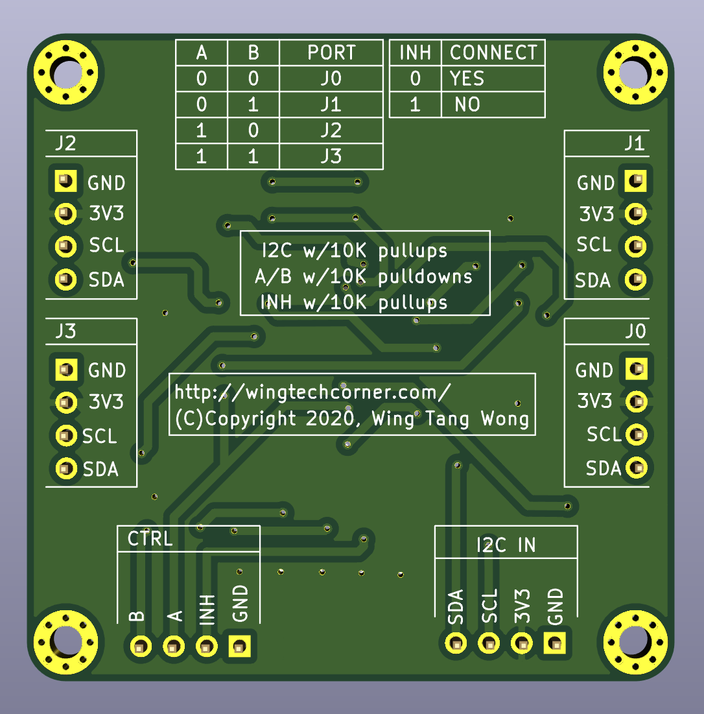

# Wing's I2C Multiplexer

- Multiple I2C devices with the same address on the same bus.
- Not full duplex. Only one device active at any one time.
- Performs MUX'ing via 4052D IC

# Files/Folders

- `platformio.ini` PlatformIO project config file
- `./src/` Source code
- `./hardware/` Various hardware design files.

# Datasheets

- 4052D Dual 4-Channel Analog Multiplexer, Demultiplexer
  - [Nexperia 74HC4052D Datasheet from LCSC](https://datasheet.lcsc.com/szlcsc/Nexperia-74HC4052D-653_C11350.pdf)

